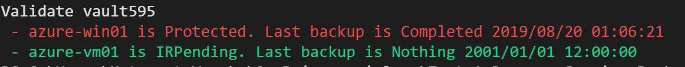

# Test-AzRecoveryServicesBackupItem

Validate your backup items which are in the Recovery Service Vault.

This script checks all Recovery Service Vault which you can access to and validates the backup items. If a backup item matches the following conditions, this script shows red message.

- `lastBackupStatus` is not `Complete`
- `LastBackupTime` is older than 7 days ago.



## Usage 

Open Cloud shell and:

```
cd $HOME
git clone https://github.com/kongou-ae/Test-AzRecoveryServicesBackupItem.git
cd Test-AzRecoveryServicesBackupItem
./Test-AzRecoveryServicesBackupItem.ps1
```